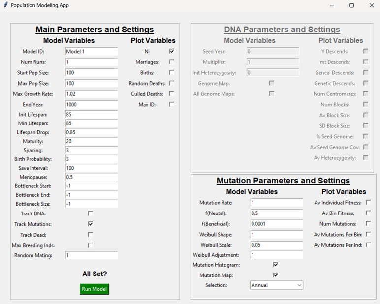

# DRIFT: The Dynamics of Recombination, Inheritance, and Fitness in Time

A comprehensive population genetics modeling software for the creationist community

# Overview

Students of the Bible are often confronted with questions about population growth and population genetics. For example:

- How many people could have been alive at the Flood?
- How many people could have been alive at Babel?
- How could 2.3 million Israelites have left Egypt if only 70 people went in?
- Can you get 2.3 million people in a ‘short’ Egyptian Sojourn of only 215 years?

These have already been addressed in the literature (e.g., [here](https://creation.com/biblical-human-population-growth-model)), but this does not mean every aspect of these questions has been answered. Also, many people might want to explore the question for themselves.

We are sometimes presented with more complex questions that take a specialist to answer. For example:

- How can all people descend from Adam and Eve? Would they have had enough genetic diversity to account for all the different types of people we see today? Would not the inbreeding among their children (and those of Noah) have been bad for humanity?
- Can Swamidass’ [‘Genealogical Adam and Eve’](https://creation.com/review-swamidass-the-genealogical-adam-and-eve) model and Craig’s [‘Adam was a _Homo heidelbergensis_’](https://creation.com/historical-adam-craig) claims be answered by creationists?
- How did the number of differences seen between humans and chimps arise in just a few million years, or is this even possible?
- What are the effects of population bottlenecks like the evolutionary pre-Out of Africa bottleneck or the biblical [Flood bottleneck](https://creation.com/genetic-effects-of-the-flood)?
- Can we explain long-term survival of long-lived species with small populations (e.g., Sanford’s [‘Genetic Entropy’](https://creation.com/mendels-accountant-review))?

To address these questions, and potentially many more, this flexible, open-source population modeling software was created. To make it as accessible to as many people as possible, it is written in the popular programming language Python.

The program comes in two parts: a simple graphical user interface (GUI) that allows for the input of various control parameters, and the main population modeling program. Besides displaying selected data onscreen during the run, all data are saved to a results file. An advanced user will find that it is possible to run the software without the GUI, with modifications, allowing for easy automation.

# Features

The program can be used to model populations of any size (up to the limits of computer memory) with a large range of possible parameters. The program was designed to reproduce the features of [_Mendel’s Accountant_](https://creation.com/mendels-accountant-review), but with overlapping lifespans instead of _Mendel’s_ discrete generations. Thus, smaller populations can be more easily modeled. Two different selection protocols are featured: **birth selection** (whereby the average mutation load of the parents affects how many children they have) or **annual selection** (whereby the survival of all individuals in the population is according to a modern actuarial table). Mutation rates, average mutation effects, etc., are controlled by the user.

One can run models with no mutation effects, so simple population growth experiments are easy to deploy. It is also possible to track the genetic and genealogical contribution of an individual or individuals introduced into the population at any time. The ‘seed’ individual is assigned a digital genome with all bits set to ‘1’. As the generations progress, any individual descended from the seed inherits sections of that person’s digital DNA. A simple recombination model with one recombination per chromosome arm per generation is applied. One can track the genetic and genealogical descendants of the seed individual(s), the number and average size of recombination blocks, the number of ‘seed’ centromeres remaining in the population, etc. One could also combine mutation with population growth while tracking the descendants of an Adam and an Eve. More advanced users can now answer questions like the maximum number and strength of mutations that a human-like species can withstand, or how much migration between populations is required to completely homogenize them.

The software was designed to be flexible and modifiable. New parameters, subroutines, models, and data calculations can be added easily.

# Requirements

The software runs on Python 3. The GUI requires the Tkinter library. The main program requires the modules os, csv, math, random, numpy, scipy.stats, bitarray, collections, and matplotlib. Check the first few lines of the two programs for the list of dependencies.

# Installation

To use this software package, Python 3 must be installed on your system. If you don't have Python installed, you can download it from the [official Python website](https://www.python.org/). The required libraries listed above can be installed using standard Python methods (e.g., run `pip install -r requirements.txt` in the command line).

An installation program (e.g., install.bat) is not included, but setup is simple. Unzip the download file into your directory of choice. If, for example, the user unzipped it into the folder C:/Python/DRIFT, two additional folders will be created:

- C:/Python/DRIFT/Data
- C:/Python/DRIFT/Results

These files will be in the main directory:

- CPGM-GUI.py, CPGM-main.py

These files will be in the Data directory:

- ActuarialTable.csv, ChromosomeData.csv, ExamplePop.csv, ParameterDefaults.csv, PlotDefaults.csv
- Three additional image files (used in this readme) will also be in the directory.

The Results directory will be empty.

The file system is relational. Thus, the only thing that matters is that the Results and Data subdirectories exist in the folder that contains the program.

Alternatively, the user might want to work with an environment management system (e.g., Anaconda). Instructions are not included here, but any user with a basic understanding of such things should not have too much trouble with the setup.

# Usage

The method needed to run the program is platform dependent. On a Windows machine, after navigating to the program directory, the command to run the program would be:

     C:\Python3.11\Programs\DRIFT> python.exe cpgm-gui.py

This will launch the GUI. This is a simple data entry form in which you can enter the relevant model parameters.

#The GUI

**Beware:** If you run multiple models with the same ID, the older data will be overwritten.
**Beware:** Enabling the parameter TrackDead can potentially create very large files. This option is disabled by default. At present, there is no confirmation step when this is enabled.

The GUI has three frames, each with two columns. Within each frame, the population parameters are on the left. The parameters that will be plotted during the model run are on the right (all data are saved, but only some are shown on screen).

The data frames are initialized with the information contained in ParameterDefaults.csv and PlotDefaults.csv. When running many similar models, the user can easily modify the values in those files so that GUI is automatically populated with the desired initial settings. [This also means that the GUI can be skipped entirely, with just a few modifications, by loading the defaults straight into the main program]

The **DNA Parameters and Settings** and **Mutations Parameters and Settings** frames are enabled via the **Track DNA** and **Track Mutations** checkboxes in the **Main Parameters and Settings** frame (on the left). In this example, only the Track Mutations checkbox is checked, so only the Mutations Parameters and Settings frame is enabled.

Enabling Track DNA allows the user to track the DNA and genealogy of a ‘seed’ individual or individuals over time. The seed is added to the population in the year set by the seed year parameter. Currently, the seed is chosen at random. The individual could be male or female and can be of any age. There is no advantage to being the seed (e.g., reduced risk of death or enhanced probability of becoming a parent) and the seed’s descendants are also given no advantages. These are areas that can be easily modified.

Enabling Track Mutations opens a range of additional parameters, including the mutation rate (**mu**), the fraction of neutral mutations [**f(neutral)**], the fraction (of the non-neutral mutations) that are beneficial [**f(beneficial)**], the shape (**Weibull Shape**) and scale (**Weibull Scale**) of the Weibull curve used to set the mutation effects, and an adjustment factor (**Weibull Adjustment**) to reduce the general mutation effects.

Track DNA and Track Mutations use two different engines. Tracking DNA is more memory efficient. When enabled, individuals are assigned two bitstrings **numbits** long. These represent the two copies of the genome in each individual. Numbits is dependent on a genome model that is loaded at the beginning of the run. A default human genome (ChromosomeData.csv) is included in the Data directory. It includes a list of each chromosome arm in the human genome and its length (in megabases). Thus, it is possible to locate any given chromosome arm in a digital genome. These locations are used to control meiosis (explained below).

To save memory, any individual who has zero set bits is deleted from the chromosomes variable.

Tracking mutations is more memory intensive. Any given mutation needs to be assigned both a location and an effect. Instead of tracking all mutations with individual IDs, however, mutation effects are added to the bins **mutations** dictionary. All mutations in any given bin will either propagate or be lost during meiosis and the fitness effect of any given bin is tabulated by simply summing the effects of the mutations contained in that bin. A histogram of all mutation effects that appear during the model run is stored in memory and saved at the end of the run if the **Mutation Histogram** checkbox is enabled.

Currently, the population age distribution is initialized by sampling from an example population (ExamplePop.csv). The age distribution data were generated by using this program to model a static population of 10,000 individuals for 100,000 years. The ages of living people were sampled at the end of the run and saved. In all model runs, survivorship is dictated by an actuarial table (ActuarialTable.csv) that matches the age distribution of an impoverished country obtained from the WHO:[WHO LIFE TABLE FOR 1999: AFR D](who.int/healthinfo/paper09.pdf).

# The Meiosis algorithm

Meiosis is a critical phase in the life cycle of all sexually reproducing organisms, and so it must be represented accurately in these digital organisms. In the current configuration, a random recombination location is chosen for each chromosome arm during the meiosis loop. One of the two chromosome copies is chosen at random and a mask is then generated for the entire genome. For each chromosome, the bits in the mask are then set, either at the center (e.g., from the first recombination point, through the centromere, to the second recombination point) or at the ends, depending on which centromere is chosen. The mask is then applied to the first copy of the individual’s genome with an AND (&) comparison. The inverse (~mask) is applied to the second copy with a second AND comparison. Both copies are then combined with an OR comparison:

     child_copy = (mask & parent_copy_A) | (~mask & parent_copy_B)

This will be the copy of the genome that the child inherits from one parent. The process is simply repeated for the second parent to generate the diploid genome. Here is a visual representation of the process:

For any given chromosome (dark blue), random locations (red Xs) are selected to the right and left of the centromere (black circle). One centromere copy is then randomly chosen to be inherited. By setting the bits in the mask appropriately, a simple combination of AND, OR, and NOT results in a bitstring that can be inherited by a child from one parent. The two parental copies are color coded to help visualize the process of inheritance.

Meiosis is used when either Track DNA or Track Mutations are enabled.

# Main Parameters and Settings Frame

## These are the main, user-defined input parameters:

- Model ID: a unique identifier for this model run (change with each run or the data will be overwritten).
- Num Runs: the number of times this model will be repeated. Plots can be saved at the end of each run. All data are saved in the Results directory.
- Start Pop Size: The starting population size.
- Max Pop Size: The maximum population size. Use this for modeling growth or set it equal to Start Pop Size for static populations.
- Max Growth Rate: The maximum population growth rate per year.
- End Year: The number of years to run the model.
- Init Lifespan: The starting lifespan of individuals in the model population. The ‘seed’ individual(s) can have his/her/their own initial lifespan.
- Min Lifespan: The minimum lifespan. This is only used when Init Lifespan is greater than Min Lifespan. Lifespans will drop each generation, but not below this value. There is no ‘Max Lifespan’ because death is controlled by an actuarial table and the death rates of older individuals are quite high. Yet, if an individual is tested for death every year, it is entirely unlikely that any individual could live to ‘biblical’ lifespans, so the probability of death is scaled according to the percent of the maximum lifespan the individual has reached.
- Lifespan Drop: When modeling ‘biblical’ ages, this is the rate at which lifespan decreases per generation. This will bottom out at Min Lifespan.
- Maturity: The age at which males and females can marry.
- Spacing: The minimum number of years between children.
- Birth Prob: The probability (1/x) of an eligible female giving birth in any given year.
- Save Interval: This controls both data plotting and data saving. An extra plot and save are triggered at the end of each run.
- Menopause: The proportion of a female’s maximum lifespan where she stops having children. At present, menopausal woman do not get remarried upon the death of their husband.
- Bottleneck Start: At this specified year, the population will be reduced to Bottleneck Size individuals by randomly killing off individuals.
- Bottleneck End: At this specified year, the population will be allowed to grow, at Max Growth Rate, until it eventually achieves Max Pop Size.
- Bottleneck Size: The size of the population during the bottleneck.
- Track DNA: Activates the DNA Parameters and Settings frame.
- Track Mutations: Activates the Mutations Parameters and Settings frame.
- Track Dead: This will create a file in the Results directory that includes the life history data of every individual born into the population. This allows the user, for example, to create family trees or to assess many other potentially useful statistics. The file size increases linearly with n and runtime (e.g., a population with 1,000 individuals run over 100 years will produce a 2.3 GB file, minimally, but that same population over 1,000 years will create a 26 GB file), so it should be possible to estimate the final size after running a few small prototypes. It should also be possible for an advanced user to programmatically restrict the output data fields to only the ones being studied.
- Max Breeding Inds: This sets the maximum number of adult males and adult non-menopausal females in the population. Excess people will be randomly culled (including children) until this limit is not exceeded. Max Breeding Inds can also be applied to bottlenecks.
- Random Mating: Individuals are assigned a random location within a circle with radius = 0.5 units during the setup loop. Currently, when children are born, they are assigned the latitude and longitude of their father. Two individuals cannot marry if they are located > Random Mating units apart. Set this to ‘1’ for truly random mating.
- Run Model: This will launch the main program. The button will turn red during program execution and return to green when it is finished.

## These are the plot parameters for this frame:

- N: The population size at the save year.
- Marriages: The number of marriages that have transpired between save intervals.
- Births: The number of children born into the population between save intervals.
- Random Deaths: The number of random deaths that happened between save intervals.
- Culled Deaths: The number of excess people who had to be killed off between save intervals to keep the population in check (either below the max pop size or below the growth threshold).
- Max ID: Each individual is given a unique identifier. This will show how many people were born into the population regardless of population size.

Upon execution, the program will create a graph window and plot the variables that were checked in the Plot columns of the GUI. The graphing feature is primitive. You will not see small values when attempting to plot large and small values on the same graph. To help, variables that are on a percent scale will be shown on the secondary y-axis. The graph will be updated at the end of each Save Interval.

When the model run is completed, assuming the population has not gone extinct, the program will halt execution until the plot window has been closed. This allows the user to modify the view and/or save the plot. If Num Runs > 1 (specified in the GUI), the model will restart from the beginning. This will be repeated Num Runs times.

# DNA Parameters and Settings Frame

## User-defined input parameters:

- Seed Year: The year in which the individual(s) whose DNA is to be tracked is introduced.
- Multiplier: To allow for finer recombination, use this to increase the size of the genome. The default size is 3,108 bits, which corresponds to the length of the human genome divided by one million. Chromosome arms range from 153 to 13 bits. This is read from a data file that can easily be modified by the user. Each bit corresponds to one recombination block. More than one mutation can exist in any given recombination block. At present, all mutation effects are additive.
- Initial Heterozygosity: This will set the bits in one copy of each individual’s digital genome to ‘1’, probabilistically, according to the value in this box. If Initial Heterozygosity = 1, every bit in one copy of each individual’s genome will be set. If Initial Heterozygosity = 0.5, one half of the bits in one copy will be set, randomly. Etc.
- Genome Map: This will save a .png file that includes a map of the genome at the top. This is followed by the genomic data for each individual, two lines each.
- All Genome Maps: This will save a unique genome map at each save interval.

An example genome map: This is the top-left portion only. Chromosomes are denoted along the top. Green = telomeres. Blue = centromeres. White = individual chromosome arms. Here, a seed individual was introduced at year 0 and his/her DNA was allowed to mix into the population as meiosis broke the seed DNA into smaller and smaller fragments (red).

## Plot parameters:

- Y Descends: The current number of Y chromosome descendants from the seed(s).
- mt Descends: The current number of mitochondrial descendants from the seed(s).
- Geneal Descends: The current number of genealogical descendants from the seed(s).
- Genetic Descends: The current number of people who carry DNA from the seed(s).
- Num Centromeres: The current number of seed centromeres circulating in the population.
- Num Blocks: The number of chromosomal blocks from the seed(s) currently in circulation.
- Av Block Size: The average size (in bits) of circulating genomic blocks.
- SD Block Size: Standard deviation of Av Block Size.
- % Seed Genome: The percentage of the seed genome(s) still in circulation.
- Av Seed Genome Coverage: The average number of times a seed genome bit is found.
- Av Heterozygosity: The average population-wide heterozygosity of seed genome bits.

# Mutations Parameters and Settings Frame

## User-defined input parameters:

- Mu: The mutation rate.
- F(neutral): The proportion of all mutations that are truly neutral.
- F(beneficial): Of the non-neutral mutations, the proportion that are beneficial. For example, if F(neutral) = 0.5 and F(beneficial) = 0.5, beneficial mutations will appear 25% of the time.
- Weibull Shape: One of the two parameters used by the Weibull distribution.
- Weibull Scale: The second parameter used by the Weibull distribution. When Shape = 1 and Scale = 0.5, the Weibull distribution is identical to an exponential distribution.
- Weibull Adjustment: Python has a standard Weibull distribution algorithm, but the values returned (0 to 1) are much too high to be used as mutation effects, so they much be scaled down by 1/x.
- Mutation Histogram: Saves a histogram of the mutation effects of all mutations that ever appeared in the model run and the mutations in circulation at the end of the run. This allows for a quick visual demonstration of the strength of selection.
- Mutation Map: Similar to the DNA map, this creates a .png image with a genome map at the top. Each individual is then represented by two rows. The mutation effect of each genomic bin is represented by the color of the bits in the rows.
- Selection: This is a drop-down with two settings.
  - Annual: Any given individual has a risk of dying each year. The risk is given in an actuarial table loaded at the beginning of the run. When this form of selection is enabled, the risk of dying is increased by the sum of the mutation effects carried by the individual. This is the default setting.
  - Birth: Averages the parent’s mutation burden and subtracts this from birth_probability in the main program. This effectively reduces the chances of high-mutation-burden couples from having children. This is most similar to the way selection is handled in Mendel’s Accountant.

## Plot parameters:

- Av Individual Fitness: The average fitness of all individuals in the populations. Fitness is additive: a simple sum of all mutation effects carried by the individual.
- Av Bin Fitness: The average fitness per bin across the population.
- Num Mutations: The total number of mutations in circulation.
- Av Mutations Per Ind: The average number of mutations carried by each individual.
- Av Mutations Per Bin: The average number of mutations per bin across the population.

# Program guts

These are the main variables used during a model run:

- The parameter settings in the GUI are saved in a dictionary called Model.
- IndData is a dictionary that contains life history data for each individual.
- free_params is a dictionary that is used to track variables that can change during the run (e.g., numinds and max_ID).
- chromosomes is a dictionary that contains two bitarrays per individual, each numbits long. It will stay blank if Track DNA is not selected. To reduce memory, individuals with zero set bits are deleted from chromosomes. numbits is calculated from the data file ‘chromosome data.csv’ (currently 3046 bits).
- mutations will stay blank if track mutations is not selected. Otherwise, it will be populated with 2 lists per individual, where each item in the list is, in turn, a list of the mutation effects they carry at each position.
- mutation_hist is a list of mutations effect sizes and the number of times they have appeared during the model run. This is only populated if Mutation Histogram is selected.
- dead_dict will stay blank if Track Dead is not selected. Otherwise, it will keep track of deceased individuals. It is cleared out every save interval.
- tracking keeps up with the sums of a few important parameters that accumulate between save intervals.

# Program execution

This is order of operations each model year:

1. Inoculate the population with the seed individuals(s) if year = model[‘inoculation_year’].
2. Make a list of women who are ready to give birth.
3. Births, meiosis, inherit old mutations, add new mutations.
4. List men and women available for marriage.
5. Arrange marriages (newlyweds will be ready to have a baby the following year).
6. Remove people from the population, first according to the actuarial table, then random culling.
7. Save data at specified intervals.

# Example usage

1. The user wants to run a simple population growth model. They choose a Model ID, set Start Pop Size to 100, and set Max Pop Size to 10,000. They leave everything else at default and hit Run Model. The population size at each save year will be graphed on screen.
2. The user wants to assess the effects of a population bottleneck. They set the Start Pop Size to 10,000, the Bottleneck Start to year 100, and the Bottleneck End to year 800. They click the Track DNA checkbox and check Av Heterozygosity in the Plot Variable column before clicking Run Model.
3. The user wishes to know the largest average mutation effect that can be tolerated in a small population. They start by setting Start Pop Size and Max Pop Size to 200. After clicking the Track Mutations checkbox, they set Mu to 100, f(Neutral) to 0.5, and they check the Mutation Histogram checkbox. In the Plot columns, they also select a few variables that they wish to track during the model run. After running the model, they adjust the mutation parameters to force the population to survive long-term, changing the Model ID each time. Finally, they open the saved data files in a spreadsheet and graph their results.

# Adding new features

Adding parameters to the GUI is simple. All one has to do is add an item to either Parameter Defaults.csv or Plot Defaults.csv then direct the main program to take appropriate action. For example: the user wants the speed and efficiency of the DNA tracking algorithm without the overhead of the mutation algorithm. As long as all mutations have the same effect (whatever that might be), it should be possible to do this. So, the user adds a line to Parameter Defaults.csv:

parameter label type value_format default group
Use_DNA_engine Use DNA Engine Check bool 0 Mutation

Now, when the program launches, a checkbox labeled Use DNA Engine will appear in the Mutation Parameters and Settings frame. The checkbox default setting is 0 (unchecked) and the setting will be accessible in the main program under model[‘Use_DNA’]. All one has to do is capture that setting at the appropriate place in the program (e.g., if model[‘Use_DNA’]: ) and redirect program execution to a new feature or a new subroutine.

# Contributing

We welcome and encourage contributions from the community! If you're interested in enhancing this software, here are several ways you can contribute:

# Reporting Issues

If you come across any bugs, glitches, or unexpected behavior while using the software, please open an issue. When reporting issues, be sure to include detailed information about the problem, including steps to reproduce it and information about your system environment. Your feedback is invaluable in helping us improve the software.

# Feature Requests

Have an idea for a new feature or enhancement? We'd love to hear it! Please submit a feature request on our GitHub repository. Provide a clear description of the proposed feature and its potential benefits to the software. Note that we are depending on the creativity of you, the user, to come up with solutions, hence the reason why we made the program open source!

# Pull Requests

If you have coding skills and would like to contribute directly to the codebase, you can submit a pull request. Follow these steps to contribute:

- Fork the repository: Click the "Fork" button on the top right of the GitHub page.
- Clone your fork: Use git clone to copy the repository to your local machine.
- Create a new branch: Switch to a new branch using git checkout -b feature/your-feature-name.
- Make your changes: Implement the new feature or bug fix in the new branch.
- Test your changes: Ensure that your changes work as expected and don't introduce new issues.
- Commit your changes: Use clear and concise commit messages.
- Push to your fork: Push your changes to your GitHub repository.
- Create a pull request: Submit a pull request from your branch to the main repository's main branch.

Our team will review your pull request, provide feedback, and work with you to integrate the changes into the software.

# Coding Guidelines

To maintain a consistent and readable codebase, please follow standard Python coding practices and make sure to add explanatory comments wherever practical. By contributing to this software, you become a valuable part of the project's community. We appreciate your efforts and look forward to collaborating with you!

If you have any questions or need assistance, feel free to reach out to us through the issue tracker or contact us via email.

# Acknowledgments

This program was developed mainly by [Dr. Robert Carter](https://creation.com/dr-robert-carter), with help on earlier versions from Chris Hardy and Matthew Powell. Dr. John Sanford’s work on [Genetic Entropy](https://creation.com/mendels-accountant-review) was the main inspiration for this work, and the team that brought that project to fruition cannot be overlooked.

# Contact

For general enquiries, please contact [us@creation.com](us@creation.com).

# Changelog

1 Mar 2024: First public upload of version 1.0.

# Known Issues

No major issues at present, but there are several small bugs.

# Support

This software is free to use. Parties that would like to make a donation in way of thanks can contact Creation Ministries International via [Creation.com](http://www.creation.com/).

# Frequently Asked Questions (FAQ)

1. Do I have to pay to use this program?
   Absolutely not!
2. Can I modify the program?
   Absolutely so!
3. How much memory does it require?
   That depends on the size of the modeled population and whether TrackDNA and TrackMuts are enabled.
4. How much disk space will the output files take up?
   Again, that depends on the model parameters. Enabling TrackDead will save the life history data of every person ever born into the population, which can potentially create very large files.

# Roadmap

In the future, the ability to save and load models mid-run is greatly desired. This will allow the usage of standardized models across experiments, forking of events, repeating experiments, and allowing for ‘burn in’ time when looking, for example, at mutational accumulation and drift in large populations over long periods of time.

Currently, the software only runs on a local computer. Parallelization and/or cloud computing would enable the modeling of much larger populations and for longer model time.

It should also be easy to implement tribes and to control migration among the tribes. Currently, all individuals are assigned an x-y position within a unit circle centered on (0,0). The locations are stored in IndData[ind][‘lat’] and IndData[ind][‘lon’]. These positions naturally fall within one of four quadrants. Thus, dividing the population into two or four tribes is just a matter of controlling who can mate with whom across the quadrant boundaries.

Further memory optimization will be achieved by using cython for some of the variables.

# How to Cite

When reporting the results of any experiment based on this software, please cite:
Carter, R.W., DRIFT: a population genetics modeling software for the creationist community, Creation.com, TBA.

# Disclaimer

We stand by the accuracy of the software algorithms in general, but there is always a possibility that bugs have been inadvertently introduced, so use this at your own discretion. Beware the fact that this software can potentially create very large data files. Finally, any conclusions should be thoroughly doublechecked prior to publication!

# License

This program is released under the [Open Source Initiative MIT license](https://opensource.org/license/mit/). We request that the software not be used for commercial purposes and that proper attribution (see How to Cite above) is always given.
